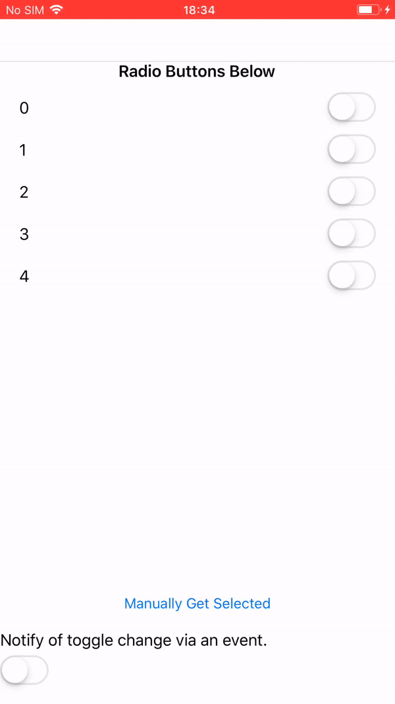

# A simple Xamarin.Forms Radio Button
I needed a fast & simple radio button for Xamarin.Forms. I saw some great samples out there, but they were too complicated for my use case.

## Features
- Fast and lightweight. It is a composite control utilising the baked in Xamarin.Forms SwitchCell. High performance, no custom renderers, no bloated ViewCell and fully supported on all current Xamarin.Forms platforms.
- Targets .NET Standard 2.0 with a single dependency on Xamarin.Forms
- Full MMVM support.
- Publishes an event when the toggled item changes. You can subscribe to this event in your code behind or use a behavior to forward it to a ViewModel.

## How do I use it?
I included a sample project. Check it out. Or, just copy/paste the code right out of it without a second thought. It's up to you :)

## How do I contribute?
Open an issue here on Github, or just submit a well documented PR. You could obviously just kang this repo and never contribute back, it's totally up to you. But that would make me sad :(.
